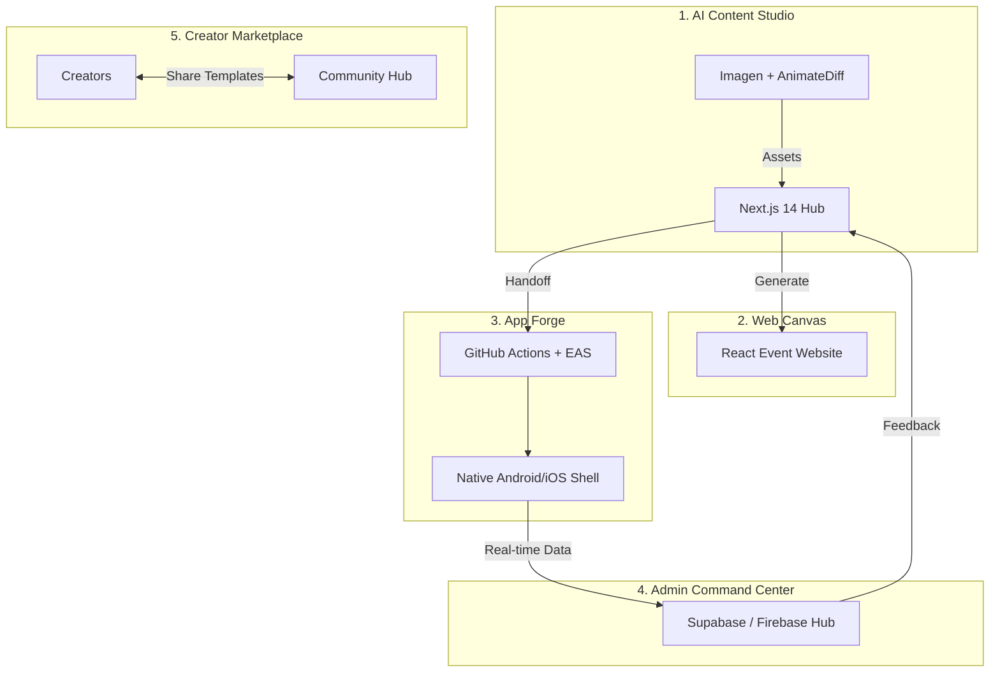

# 🌌 Ek Manch: The AI-Powered Event Operating System
### Beyond Apps. Beyond Websites. A Complete Event Universe.

**Ek Manch** is a revolutionary "Event OS" that integrates AI-driven content creation, instant web deployment, and automated mobile app forge into a single unified ecosystem. Built for creators, organizers, and enterprises, it transforms a simple text prompt into a fully interactive event experience.

---

## 🏗️ The Multi-Platform Architecture

Ek Manch is not a single tool; it's a symphony of five specialized modules bridging Web, Mobile, and AI.



---

## 🎥 Experience the Ecosystem

*Note: If videos do not play automatically, please [view the video folder directly](./video).*

| **Feature** | **Visual Showcase** | **Technical Core** |
| :--- | :--- | :--- |
| **Control Plane** |  | **Centralized Hub**: Next.js 14 dashboard managing all event assets and configurations. |
| **Website Builder** |  | **AI Design Engine**: Prompt-to-web transformation using multi-agent logic. |
| **App Builder** |  | **Zero-Code Mobile**: Config-driven Expo shell with dynamic module injection. |
| **AI Content Studio** |  | **Generative Magic**: AnimateDiff (Video) & Google Imagen (Posters). |
| **Marketplace** |  | **Community Hub**: Discovery and sharing of event templates and blueprints. |

---

## 🚀 Key Modules & Flows

### 🎨 AI Content Studio
- **Poster Generator**: High-resolution branding assets generated via Google Imagen.
- **Video Generator**: Dynamic text-to-video promos using AnimateDiff and FastAPI.
- **AI Phrases**: Professional event copy and captions generated instantly.

### 🌐 Website Builder
- **Instant Deployment**: Generate a responsive React landing page from a prompt.
- **Blueprint Logic**: AI researches your event topic to suggest optimal sections and content.

### 📱 App Builder (The Forge)
- **CI/CD Bridge**: Uses GitHub Actions and `workflow_dispatch` to trigger EAS builds.
- **Dynamic Theming**: Every color, font, and icon is injected at build time from the web config.

### 🏪 Creator Marketplace
- **Template Sharing**: Browse and use community-created event blueprints.
- **Monetization**: (Roadmap) Creators can list premium event architectures.

---

## 🛠️ Technical Stack

- **Frontend**: Next.js 14, Framer Motion, TailwindCSS
- **Mobile**: React Native, Expo, Zustand Feature Registry
- **Backends**: Express.js (Orchestration), FastAPI (AI/Video), Python (Worker)
- **Intelligence**: Google Cloud Vertex AI, AnimateDiff
- **Infrastructure**: GitHub Actions, EAS, Supabase (RLS Protected), Firebase

---

## 🚀 Getting Started

### 1. Unified Setup
```bash
git clone https://github.com/kushdhruv/EkManch.git
cd EkManch
```

### 2. Launch the Control Plane (Frontend)
```bash
cd frontend
npm install
npm run dev
```

### 3. Launch the App Template (Mobile)
```bash
cd expo-template
npm install
npx expo start
```

---

## 🛡️ Scalability & Reliability
- **Multi-Tenant Isolation**: Data is strictly sandboxed at the DB level using `project_id`.
- **Offline Reliability**: Mobile apps utilize a sync-queue pattern to ensure data persistence during low-connectivity events.
- **Dynamic Registry**: Navigation and features are loaded via a registry pattern, keeping binaries light and updates instant.

---
<p align="center">
  Built with ❤️ for the next generation of event organizers.
</p>
