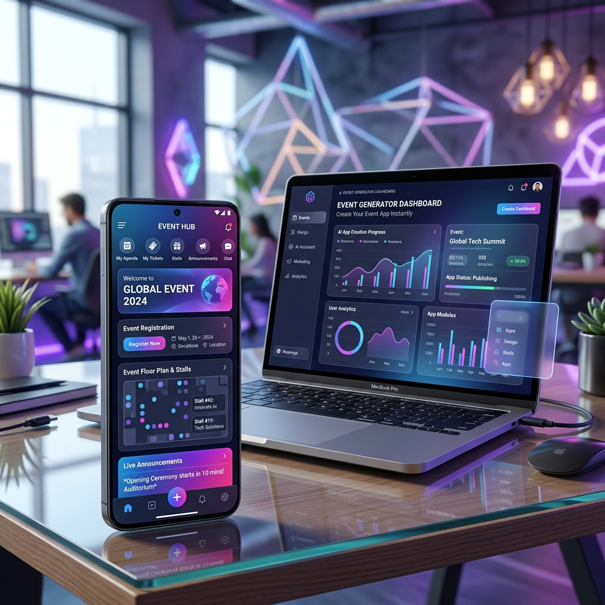
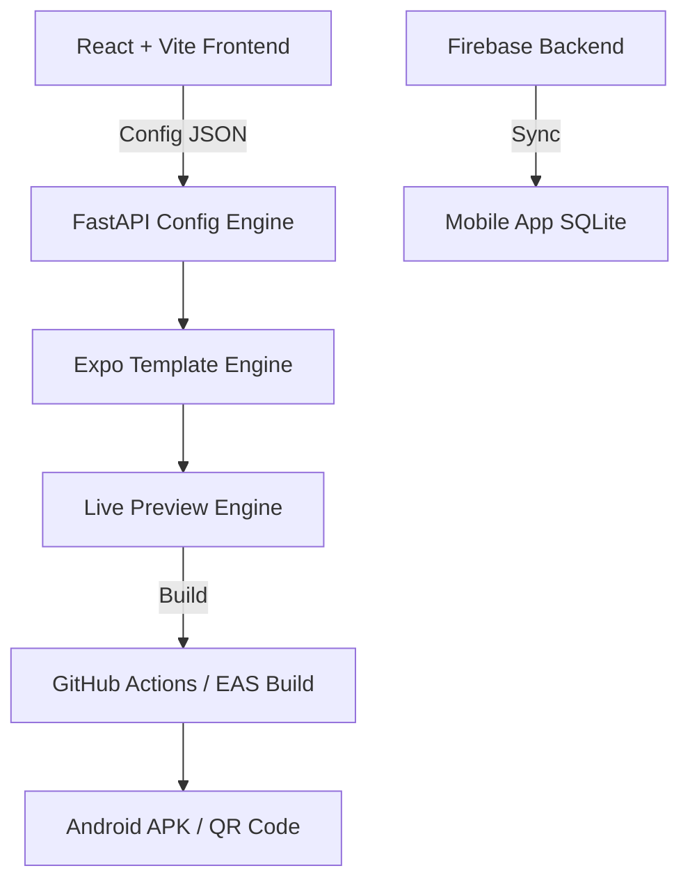

# 🚀 AI-Powered Android Event App Generator

[](https://opensource.org/licenses/MIT)
[](https://expo.dev/)
[](https://reactjs.org/)
[](https://fastapi.tiangolo.com/)



> **The No-Code Revolution for Event Management.**  
> Create, customize, and deploy revenue-generating event apps in minutes using AI-driven configuration and a robust offline-first architecture.

---

## 🎥 Experience the Magic

Watch how the platform transforms simple ideas into fully functional mobile experiences.

| **App Builder Interface** | **Real-time Mobile Preview** |
|:---:|:---:|
| <video src="assets/videos/Untitled design.mp4" width="400"></video> | <video src="assets/videos/Untitled design (1).mp4" width="400"></video> |
| *Intuitive configuration and AI chat* | *Instantly see your changes in action* |

| **Commerce & Stall Finder** | **Live Engagement Modules** |
|:---:|:---:|
| <video src="assets/videos/Untitled design (2).mp4" width="400"></video> | <video src="assets/videos/Untitled design (3).mp4" width="400"></video> |
| *Monetize with stalls and coupons* | *Voting, Live Scores, and Announcements* |

| **Registration & Onboarding** |
|:---:|
| <video src="assets/videos/Untitled design (4).mp4" width="400"></video> |
| *Seamless user flow and QR ticketing* |

---

## ✨ Key Features

### 🛠️ No-Code Builder
- **AI Chat Customization**: Modify themes, colors, and modules via natural language.
- **Template-Driven**: Choose from "Cultural Fest", "Corporate Conference", or "Sports Meet" presets.
- **Live Sync**: Every tweak in the builder is reflected in the Expo-powered preview.

### 📱 Robust Mobile App (Expo)
- **Offline-First Engine**: Uses `expo-sqlite` with a sync queue for unreliable network conditions.
- **Monetization Engine**: Built-in slots for sponsored banners, featured stalls, and coupons.
- **Dynamic Modules**: Registration, Commerce, Announcements, Live Scores, Voting, and Lost & Found.

### 🛡️ Enterprise-Ready Admin
- **Centralized Data Flow**: Real-time updates from Firebase/Supabase synced to all users.
- **Build Freeze Rule**: Locks UI structure post-deployment while keeping content editable.
- **Sponsor ROI Tracking**: Built-in analytics for impressions, clicks, and conversions.

---

## 🏗️ Architecture



---

## 🚀 Getting Started

### 1. Clone the repository
```bash
git clone https://github.com/kushdhruv/AMD_V5.git
cd KaggleGithubV1
```

### 2. Setup the Builder (Frontend)
```bash
cd frontend
npm install
npm run dev
```

### 3. Setup the Mobile Template (Expo)
```bash
cd expo-template
npm install
npx expo start
```

---

## 🛠️ Tech Stack

- **Frontend**: React, Vite, TailwindCSS (for the Builder UI)
- **Mobile**: React Native, Expo, Expo Router
- **Backend**: FastAPI, Python, SQLAlchemy
- **Database**: SQLite (Local), Firebase (Cloud Sync)
- **Deployment**: GitHub Actions, EAS Build

---

## 📄 License

This project is licensed under the MIT License - see the [LICENSE](LICENSE) file for details.

---

<p align="center">
  Built with ❤️ for the next generation of event organizers.
</p>
